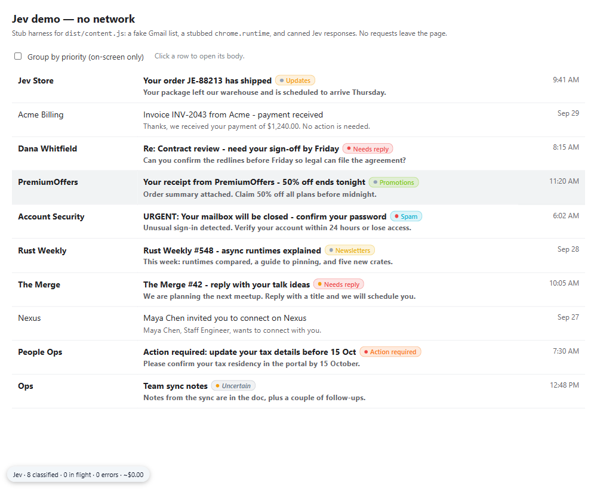
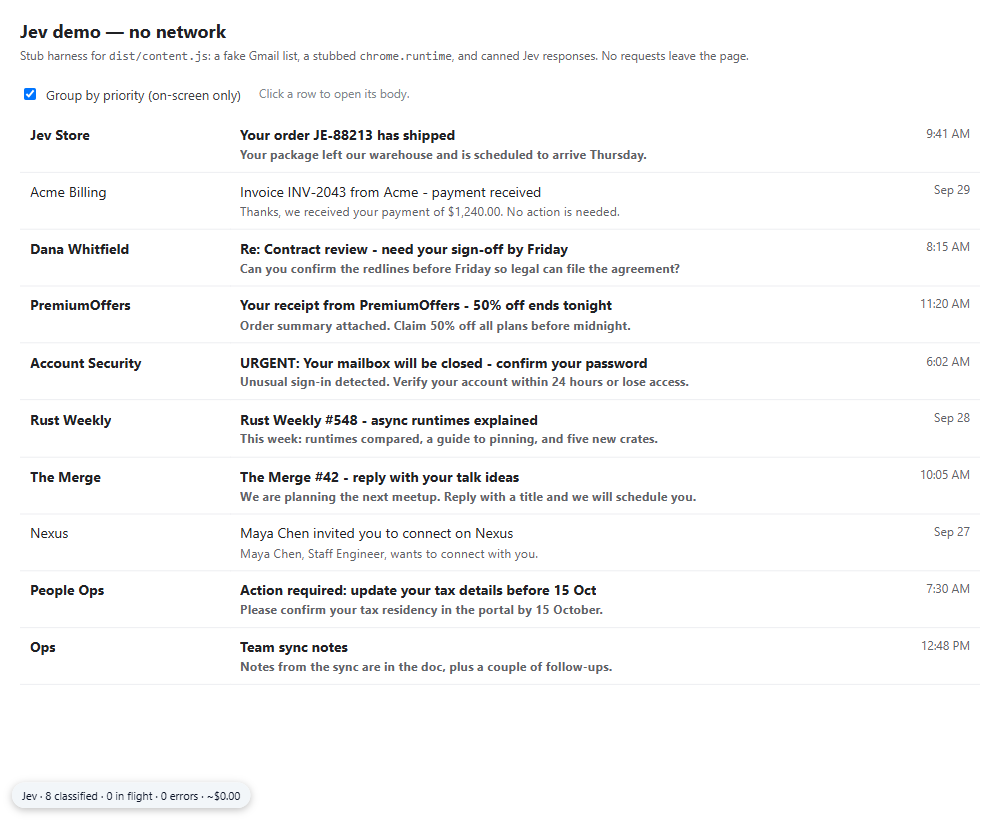
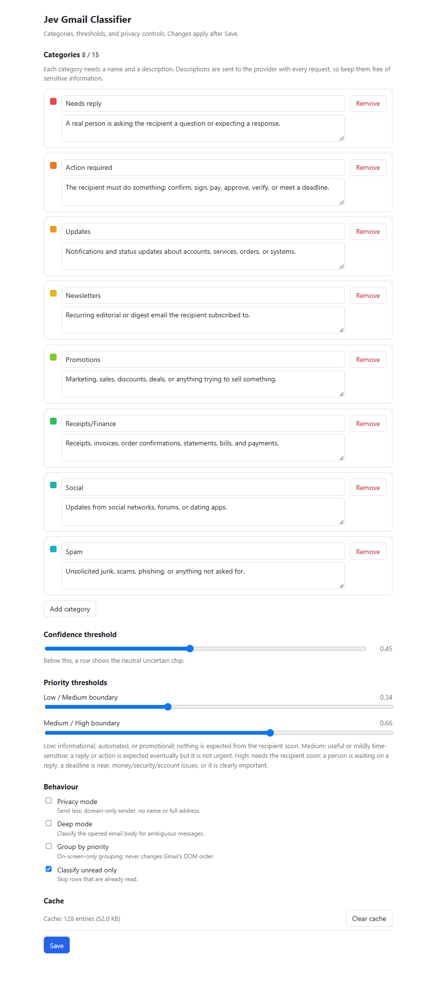
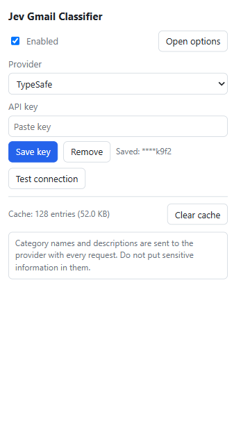
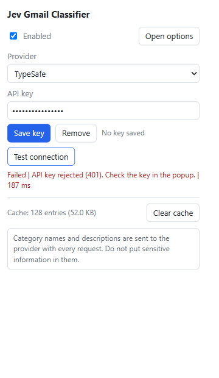
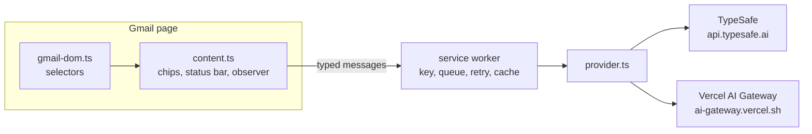

# Jev Gmail Classifier

A Chrome (Manifest V3) extension that classifies Gmail rows with [TypeSafe Jev](https://docs.typesafe.ai) — using its **Choice / Score / Noul** decision primitives, not text generation — and shows a colored category chip and priority dot on each row. Metadata-only and read-only by default, with your own API key.

[](LICENSE)
[](public/manifest.json)
[](tsconfig.json)
[](tests)
[](https://www.google.com/chrome/)

## Overview

Sorting a busy inbox means reading each message just far enough to decide what it is and how urgent it is. That is a classification problem, not a writing problem — exactly the kind of task a System One model is built for.

Jev evaluates typed questions against a piece of state and returns structured answers with probabilities and confidence. This extension feeds each Gmail row (sender, subject, snippet, date) to Jev as `state`, asks four typed questions, and renders the result inline. It never generates prose, never parses free text, and never touches your mail beyond reading the list.

It is for anyone who wants an at-a-glance triage signal in Gmail without handing their mailbox to a hosted service: the key is yours, the data sent is metadata only, and the extension is read-only.

## Demo

The screenshots below show the extension running offline with canned answers — no network, no key. The inbox shots use the bundled harness (`dev/demo.html`, a fake Gmail list driving the real built `dist/content.js`); the options, popup, and tests below that drive the real built pages (`dist/options.html`, `dist/popup.html` and unit tests via Vitest).



*Category chips and priority dots injected on each unread row, with a status bar showing classified count, in-flight, errors, and estimated cost.*



*Optional grouping by priority. Rows are moved with CSS transforms only — Gmail's own DOM order is never changed, so clicks and selection still land on the visible row.*



*Options: category editor (name + description), confidence and priority thresholds, privacy/deep-mode/grouping toggles, and cache controls.*



*Popup: on/off, provider selection, API key (shown only as the last four characters), Test connection, and cache stats.*



*Error handling: a bad key fails visibly inline instead of silently — the same path the worker uses for 401 auth errors, rate limits, and offline failures.*

## Features

- **Typed classification per row** — category, priority, spam probability, and needs-reply probability, from Jev primitives.
- **Colored category chip + priority dot** on each classified row.
- **Uncertain, not a guess** — a Choice answer below your confidence threshold shows a neutral "Uncertain" chip.
- **User-defined categories** — name + natural-language description (the description is the Jev `criteria`); add, edit, remove, up to 15.
- **Two providers** — TypeSafe directly, or Vercel AI Gateway; one interface, swappable key and endpoint.
- **Metadata only by default** — sender, subject, snippet, and date. The message body is never read.
- **Opt-in deep mode** — re-classifies an ambiguous row from the opened body when you click it.
- **Batching, debounce, retry** — a concurrency-limited queue with exponential backoff on 429/529/5xx.
- **LRU cache** — bounded to 5000 entries in `chrome.storage.local`, invalidated when the provider or categories change.
- **Read-only** — it never archives, deletes, labels, or sends. Grouping is on-screen only.
- **No backend, no telemetry** — nothing is sent anywhere except the provider you choose.

## Tech stack

| Area | Choice |
| --- | --- |
| Platform | Chrome Extension Manifest V3 (service worker + content script) |
| Language | TypeScript (strict) |
| Bundler | esbuild (`scripts/build.mjs`) |
| Tests | Vitest |
| Storage | `chrome.storage.local` only |
| Decision model | TypeSafe Jev (`jev-latest`) or Vercel AI Gateway (`typesafe-ai/jev`) |

## Architecture



The content script reads the list and injects chips; it has no network access and never sees the API key. The service worker owns the key, batches requests, retries transient failures, and caches results. Providers share one interface (`src/shared/provider.ts`).

Jev primitives map to outputs as follows:

| Output | Jev primitive |
| --- | --- |
| `category` | **Choice** over your category ids (description = criteria) |
| `priority` (Low / Medium / High) | **Score** with three descriptive levels, normalised to 0–1 |
| `spam_probability` | **Noul** (P(true), 0–1) |
| `needs_reply_probability` | **Noul** (P(true), 0–1) |

Project structure:

```
src/
  shared/            # typed protocol and pure logic (tested)
    types.ts         # message protocol + domain types
    defaults.ts      # providers, categories, thresholds, limits
    questions.ts     # settings -> Jev questions
    parse.ts         # Jev answers -> Classification (schema-checked)
    cache.ts         # LRU cache + settings fingerprint
    queue.ts         # concurrency + retry/backoff
    metadata.ts      # snippet cleaning, hashing, state building
    provider.ts      # JevProvider + TypeSafe / Vercel Gateway
    cost.ts, errors.ts, util.ts
  background/        # service worker: owns the key, queue, cache
  content/           # Gmail DOM + chip injection (no network)
    gmail-dom.ts     # every Gmail selector, isolated
  popup/             # on/off, provider, key, test connection
  options/           # category editor, thresholds, privacy
scripts/             # build.mjs, gen-icons.mjs, eval.ts
tests/               # Vitest unit tests
fixtures/            # 30 labelled emails for the eval
dev/demo.html        # zero-network UI harness
docs/gmail-dom.md    # selector notes
```

## Getting started

### Prerequisites

- Node.js 18+ and npm
- Google Chrome 120+ (for the unpacked extension)

### Install and build

```bash
git clone https://github.com/AkashNaickar/jev-email-classifier.git
cd jev-email-classifier
npm install
npm run build
```

`npm run build` writes the unpacked extension to `dist/`.

### Load it in Chrome

1. Open `chrome://extensions`.
2. Turn on **Developer mode**.
3. Click **Load unpacked** and select the `dist/` folder.
4. Open the extension popup to finish setup.

### Get an API key

- **TypeSafe** — create a key at <https://console.typesafe.ai/keys>, then choose provider "TypeSafe".
- **Vercel AI Gateway** — create a key via <https://vercel.com/docs/ai-gateway>, then choose provider "Vercel AI Gateway" (model `typesafe-ai/jev`).

Paste the key in the popup and press **Test connection**. The key is stored in `chrome.storage.local` and read only by the service worker.

### Configuration

The extension needs no environment variables — settings and the key live in `chrome.storage.local` (see [PRIVACY.md](PRIVACY.md)). Environment variables are only used by the evaluation script:

```text
TYPESAFE_API_KEY     TypeSafe key for a live eval run
AI_GATEWAY_API_KEY   Vercel AI Gateway key for a live eval run
PROVIDER             typesafe | vercel-gateway
```

Copy [`.env.example`](.env.example) to `.env` if you want to run a live eval.

## Usage

- Open <https://mail.google.com>. Unread rows in view are classified and chipped; scrolling classifies more.
- The **status bar** (bottom-left) shows `classified · in flight · errors · ~cost`.
- **Popup** — enable/disable, choose a provider, save/remove the key, Test connection, clear cache.
- **Options** — edit categories, set the confidence and priority thresholds, toggle privacy mode, deep mode, and group-by-priority.
- Clicking an ambiguous row in **deep mode** re-classifies it from the opened body.

## Testing

```bash
npm run typecheck   # tsc --noEmit
npm test            # Vitest unit tests (5 files, 75 tests)
npm run eval        # classification harness over 30 labelled emails
```

`npm run eval` prints overall accuracy, per-category precision/recall/F1, and a confusion matrix. Without a key it runs a deterministic offline stub (and says so); set `TYPESAFE_API_KEY` or `AI_GATEWAY_API_KEY` for a live run.

The UI can be exercised with no key and no network via the harness:

```bash
npm run build
python -m http.server 8787 --directory .   # or just open dev/demo.html in Chrome
# then open http://localhost:8787/dev/demo.html
```

## Known limitations

- **Gmail DOM fragility.** Gmail exposes no supported API for its page markup. All selectors live in [`src/content/gmail-dom.ts`](src/content/gmail-dom.ts); if the list structure changes, chips pause and the status bar warns once. See [docs/gmail-dom.md](docs/gmail-dom.md).
- Only rows currently rendered in the list are classified. Rows never scrolled into view are never sent.
- On-screen grouping uses CSS transforms, so Gmail's own `j`/`k` keyboard order can differ from the visible order.
- The MV3 service worker can be suspended between events, which resets the in-memory status counters; the cache is persisted.
- English-first classification accuracy (Jev's primary training language).
- Unofficial; not affiliated with, endorsed by, or supported by Google, Gmail, TypeSafe, or Vercel.

## Roadmap

- Model picker and per-provider model selection in Options.
- Optional, explicitly opt-in Gmail actions (label/archive) behind a separate toggle.

## Contributing

Issues and pull requests are welcome. Please run `npm run typecheck && npm test` before opening a PR, and keep Gmail selectors confined to `src/content/gmail-dom.ts`.

## License

[MIT](LICENSE).

## Author

Built by [AkashNaickar](https://github.com/AkashNaickar).
