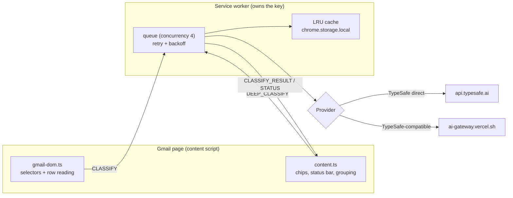

# Jev Gmail Classifier

A Chrome MV3 extension that labels each Gmail row with a category chip, a Low/Medium/High priority dot, and spam/needs-reply probabilities by asking TypeSafe Jev about one email at a time — metadata-only by default, read-only, bring your own key.


There is no hosted demo. This is an unpacked extension that runs inside your own Gmail.

## What it does

- Reads the Gmail rows that are currently rendered: sender name, sender address, subject, one-line snippet, date, and unread state.
- Asks Jev four questions about one email per request: a category, a priority, a spam probability, and a needs-reply probability.
- Draws a chip on each row: the category name in its colour plus a priority dot (red high, amber medium, grey low). The tooltip shows category confidence, priority, spam %, needs-reply %, and whether the result came from the metadata pass or the deep pass.
- Shows a status bar in the bottom-left of the Gmail page: classified, in flight, errors, and estimated cost.
- Options page: category editor, confidence and priority thresholds, privacy mode, deep mode, group by priority, classify unread only, clear cache.
- Read-only. It never archives, deletes, labels, or sends mail, and it never reorders the DOM — group-by-priority is a CSS transform only.

## How classification works

One Jev request per email. Every output maps to one Jev primitive:

| Output | Jev primitive | How it is read |
| --- | --- | --- |
| `category` | **Choice** | one option per configured category id; answer `choice` + `confidence` |
| `priority` (Low/Medium/High) | **Score** | 3 descriptive levels, normalised to 0..1 and bucketed |
| `spam_probability` | **Noul** | `noul` = P(yes), 0..1 |
| `needs_reply_probability` | **Noul** | `noul` = P(yes), 0..1 |

- The Choice question has one option per configured category (`src/shared/questions.ts`): the option key is the category id and the option text is its description.
- The Score question uses three priority levels from `src/shared/defaults.ts` (`PRIORITY_LEVELS`). The normalised priority is `score / (levels - 1)`, clamped to 0..1. `>= priorityHighThreshold` (default `0.66`) is **High**, `<= priorityLowThreshold` (default `0.34`) is **Low**, otherwise **Medium**.
- When the Choice `confidence` is below `confidenceThreshold` (default `0.45`), or the returned option is not a configured category, the row shows the neutral, italic **Uncertain** chip instead of a category name.
- The four local question ids are `category`, `priority`, `spam`, and `needs_reply`. Responses are validated and turned into a `Classification` in `src/shared/parse.ts`; a missing or malformed answer surfaces an error for that row instead of a forced guess.
- The content script batches rendered rows with a debounce; the service worker runs them through a queue with concurrency 4 and retries transient failures (429, 529, network, 5xx) with exponential backoff and jitter, honouring `retry-after`.
- Cost is estimated per response: the gateway's `provider_metadata.gateway.cost` when present, otherwise `input_tokens × $0.042 / 1M` (output tokens are free).



The message protocol lives in `src/shared/types.ts`. The content script makes no network calls and never reads the API key; only the service worker calls the provider.

## Install (load unpacked)

Requires Node.js for the build and Chrome 120+ (the manifest's `minimum_chrome_version` is `120`).

```bash
npm install
npm run build
```

Then load it:

1. Open `chrome://extensions`.
2. Turn on **Developer mode** (top right).
3. Click **Load unpacked**.
4. Select the `dist/` directory.

`npm run build` bundles the content script, service worker, popup, and options page into `dist/` with esbuild, and copies the manifest, HTML, CSS, and icons. Re-run it (or `npm run watch`) after any source change.

## Getting a key

The extension uses your own key; there is no shared key and no account with this project.

- **TypeSafe (direct)** — create a key at <https://console.typesafe.ai/keys>. Default model `jev-latest`.
- **Vercel AI Gateway (TypeSafe-compatible)** — see <https://vercel.com/docs/ai-gateway>. Model `typesafe-ai/jev`.

Paste the key into the popup, choose the matching provider, and press **Test connection**.

## Using it

Popup:

- **Enabled** toggles classification on or off.
- **Provider** chooses TypeSafe direct or Vercel AI Gateway; each stores its own key.
- **API key** with **Save key** and **Remove**; the popup shows only the last 4 characters.
- **Test connection** sends one small Noul request and reports OK/Failed, the model, latency, and (for the gateway) the cost.
- **Clear cache** and **Open options**.

Options:

- Category editor: add and remove categories, each with a name and a description (cap 15).
- Confidence threshold, plus the low/medium and medium/high priority thresholds.
- Behaviour toggles: privacy mode, deep mode, group by priority, classify unread only.
- Cache size and **Clear cache**; changes apply after **Save**.

## Categories

Each category has a **name** and a **description**. The name becomes the chip; the description becomes the Jev `criteria` for that Choice option. Both are sent to the provider with every request, so do not put secrets in them. (Concretely, the Choice `criteria` map is keyed by category id and valued by description; the id for a category you add is a slug of its name.)

The cap is 15 categories (`MAX_CATEGORIES`), enforced in `src/shared/questions.ts` and in the options UI, which disables **Add category** at the cap. The default list has 8 categories: Needs reply, Action required, Updates, Newsletters, Promotions, Receipts/Finance, Social, Spam.

## Privacy

The extension sends the sender name, sender address, subject, cleaned snippet, and date of each classified row to the provider you choose, over HTTPS, under your own key. It also sends your category names/descriptions as the Choice criteria, the priority level descriptions, and the two Noul questions. Privacy mode drops the sender name, reduces the address to `***@domain`, and truncates the snippet to 120 characters. Deep mode is opt-in and additionally sends the cleaned, truncated body of an opened message. There is no analytics, telemetry, or backend of this project, and attachments are never read or sent.

See [PRIVACY.md](PRIVACY.md) for the full detail.

## Development

```bash
npm run watch      # esbuild rebuild on change
npm run typecheck  # tsc --noEmit
npm test           # vitest run
npm run eval       # tsx scripts/eval.ts (see Testing)
```

`dev/demo.html` is a zero-network harness: a fake Gmail list with a stubbed `chrome` API and canned classifications. Open it in Chrome after `npm run build` to work on the chips and selectors without touching Gmail or a provider.

Keep every Gmail selector in `src/content/gmail-dom.ts` and update `docs/gmail-dom.md` in the same change; see that file when Gmail markup changes.

## Testing

Vitest unit tests (`npm test`) cover the shared core: cache (LRU eviction and settings fingerprint), metadata (snippet cleaning, hashing, state building), parsing (response validation, priority bucketing, Uncertain handling), question building, and the retry/backoff/concurrency queue. In this checkout that is 5 test files and 75 tests, all passing.

`package.json` declares `npm run eval` to run `scripts/eval.ts` over `fixtures/emails.json` and report accuracy plus a confusion matrix. As designed, it uses a deterministic offline stub when no key is set and a live provider when a key is set, selected with these environment variables:

```text
TYPESAFE_API_KEY    TypeSafe key for a live eval run
AI_GATEWAY_API_KEY  Vercel AI Gateway key for a live eval run
PROVIDER            Which provider to use: typesafe | vercel-gateway
```

`scripts/eval.ts` runs the classifier over the 30 labelled emails in `fixtures/emails.json` and prints overall accuracy, a per-category precision/recall/F1 table, a confusion matrix, and priority/spam/needs-reply accuracy. With no key set it uses a deterministic keyword stub and says so; the stub's figures test the harness, not Jev. Set a provider key for a live run.

## Known limitations

- **Gmail DOM fragility.** Gmail's page markup is undocumented and can change without notice. All selectors live in `src/content/gmail-dom.ts`; when the list shell exists but no rows match, chips pause and the status bar warns once. See [docs/gmail-dom.md](docs/gmail-dom.md).
- Only rows currently rendered in the DOM are classified. Scrolling renders and classifies more, but rows that are never rendered are never sent.
- Grouping is on-screen only (CSS `transform: translateY()`), never a DOM reorder, so the visible order can differ from Gmail's own `j`/`k` keyboard order.
- **Deep mode is opt-in.** By default only metadata is sent; the message body is not read unless you enable deep mode, and only ambiguous rows you open are re-classified.
- Classify-unread-only is on by default.
- The extension is **unofficial** and is not affiliated with, endorsed by, or supported by Google, Gmail, TypeSafe, or Vercel.
- As an MV3 service worker it can be suspended between events, which can reset the in-memory status counters; the cache is persisted.

## License

MIT.
